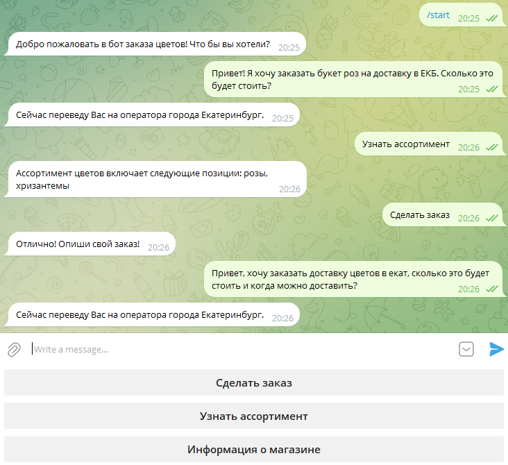

# Чат-бот магазина цветов 

✔ Python

✔ Pipenv

✔ Mistral

## Запуск программы
Перед использованием необходимо убедиться, что установлен `pipenv`. Если он отсутствует, то требуется установить, используя следующую команду:
```
pip install pipenv
```

Установка проекта:
```
pipenv install
```

Запуск программы:
```
pipenv run python run_bot.py
```

## Пример работы бота

На данный момент бот может осуществлять предсказания городов по сообщению пользователя.

